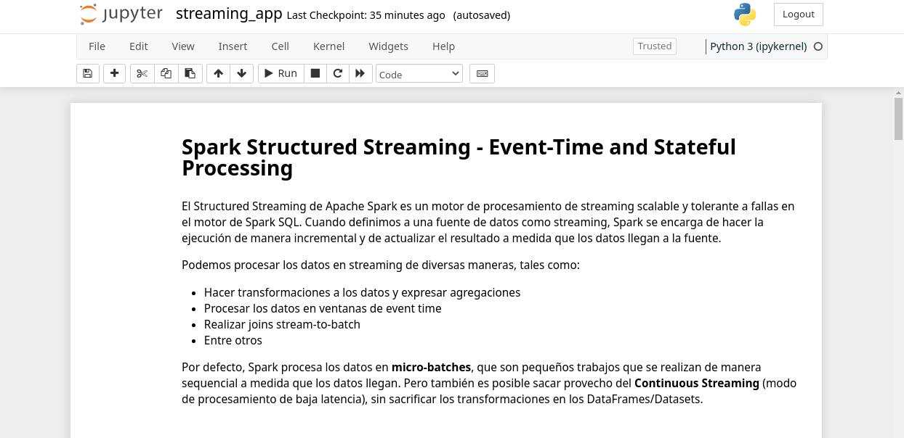

# Pyspark stateful processing example with twitter API and Apache Kafka
[] [](https://www.python.org/) [](LICENSE)
## What is this?
This is a repository of a hands-on project consisting of a pipeline of streaming processing with Apache Kafka, Apache Spark and Twitter Streaming API v2. This project is meant to understand the concepts behind stateful processing and event time processing with Spark Streaming. Data from recent tweets are ingested to one of the topics in Kafka, and then retrieved into a Spark streaming application for processing.

The Jupyter notebook provided here is writen in spanish. To use this repository or see *requirements*, please follow the instructions provided .

## De qué se trata este repositorio?
Este repositorio contiene los materiales usados en un proyecto simples de procesamiento en streaming con Apache Kafka, Apache Spark y Twitter API v2. Se trató de comprender algunos de los conceptos por detrás del procesamiento en streaming con Spark, tales como event time, stateful processing y watermarking. La idea aquí es extraer los tweets más recientes mediante una aplicación en Python, hacer la ingesta de la información a Kafka y procesarlos dentro de Spark.

La aplicación de Spark se encuentra en el `streaming_app.ipynb`. Para utilizar este repositório, por favor siga las instrucciones .

## Estructura del repositorio
```
pyspark-stateful-processing-with-twitter-kafka
│   LICENSE.txt 
│   README.md
│   requirements.txt
│
└───assets
│   │   jupyter_app.jpg
│
└───docs
│   │   en.md
│   │   es.md
│
└───src
    │   streaming_app.ipynb
    │   producer.py
    │   tweetcount.py
    │   wordcount.py
```

](src/streaming_app.ipynb)